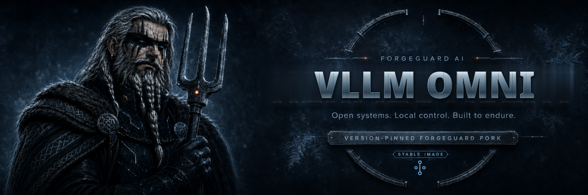

<picture>
  <source media="(prefers-color-scheme: dark)" srcset="./docs/site/assets/repository/banner-dark.png">
  <source media="(prefers-color-scheme: light)" srcset="./docs/site/assets/repository/banner-light.png">
  
</picture>

 

**ForgeGuard-maintained downstream fork of vLLM Omni — documentation and attribution only. No ForgeGuard build artifacts are published.**

[Upstream project](https://github.com/vllm-project/vllm-omni) · [Upstream docs](https://github.com/vllm-project/vllm-omni) ·
[Documentation](./docs/site/index.md) · [Support](./SUPPORT.md)

> ### Maintained fork
>
> This repository is a **ForgeGuard-maintained downstream fork** of
> [**vLLM Omni**](https://github.com/vllm-project/vllm-omni).
>
> vLLM Omni is created, owned, and developed by [`vllm-project/vllm-omni`](https://github.com/vllm-project/vllm-omni).
> ForgeGuard did not create it and claims no ownership of it, its name, or its logo.
> **ForgeGuard-specific documentation is not endorsed, supported, or reviewed by the upstream
> project.**
>
> For product documentation, always use upstream: <https://github.com/vllm-project/vllm-omni>

> ### ForgeGuard publishes no build artifacts for this repository
>
> There is **no ForgeGuard container image, no ForgeGuard package, and no ForgeGuard
> release**. Nothing is published to GHCR, npm, or PyPI under the ForgeGuard name.
>
> This fork exists for documentation and attribution. To install or run the software,
> use the upstream project's own distribution.

| | |
|---|---|
| **Upstream project** | [`vllm-project/vllm-omni`](https://github.com/vllm-project/vllm-omni) |
| **This fork tracks** | an untagged development commit (`9f3a73df1775`) of the upstream default branch — **not an upstream release** |
| **Upstream license** | Apache-2.0 — see [`LICENSE`](./LICENSE) |
| **ForgeGuard artifacts** | none published |

**Links:** [ForgeGuard docs](./docs/site/index.md) ·
[Upstream docs](https://github.com/vllm-project/vllm-omni) ·
[Upstream README (preserved)](./docs/site/fork/upstream-readme.md) ·
[Security policy](./docs/site/fork/security.md) ·
[Support boundary](./SUPPORT.md) ·
[License](./LICENSE) ·
[Fork base](./FORK_UPSTREAM_BASE)

---

## What vLLM Omni is

vLLM Omni is an upstream project maintained at [`vllm-project/vllm-omni`](https://github.com/vllm-project/vllm-omni).
This fork does not change what it is or how it works.

The upstream README from this fork's base commit is preserved verbatim at
[`docs/site/fork/upstream-readme.md`](./docs/site/fork/upstream-readme.md), and authoritative
product documentation lives at <https://github.com/vllm-project/vllm-omni>.

## How to install and run it

vLLM Omni is installed from the upstream project. It is tightly coupled to a matching vLLM release line: the `docker/Dockerfile.cuda` shipped at `v0.24.1` builds on `vllm/vllm-openai:v0.24.0`. Follow the upstream README and `docker/` directory at the pinned tag for the supported installation and serving recipes.

Use upstream's installation instructions at <https://github.com/vllm-project/vllm-omni>. ForgeGuard does not publish an
alternative distribution of this software.

> **This fork is not a release channel.** Its default branch tracks
> an untagged development commit (`9f3a73df1775`) of the upstream default branch — **not an upstream release**. Install from an upstream
> release rather than from this fork's branch state.

## What ForgeGuard adds

- Clear upstream attribution, licensing, and support-boundary documentation.
- A recorded fork base in [`FORK_UPSTREAM_BASE`](./FORK_UPSTREAM_BASE), verified in CI.
- A documented upstream-sync process.

## What ForgeGuard does not add

- **No container image, package, or release.** Nothing is published under the ForgeGuard name.
- No change to vLLM Omni source code, behavior, or licensing.
- No support commitment from the upstream project for anything ForgeGuard writes here.

## Things worth knowing

- vLLM Omni is strictly version-coupled to vLLM; a given vLLM Omni release expects a matching vLLM release line.
- Different omni pipelines need different launchers, ports, and stage counts. There is no single universal serving command.

These are properties of vLLM Omni itself, not of anything ForgeGuard built. Verify against
upstream documentation before relying on them.

## Security

Do not report suspected vulnerabilities in a public issue. See
[the security policy](./docs/site/fork/security.md); vulnerabilities in vLLM Omni itself go
upstream.

## Support

| Topic | Report to |
|---|---|
| ForgeGuard documentation or attribution | [ForgeGuard issues](https://github.com/forgeguard-ai/vllm-omni/issues) |
| vLLM Omni defects, performance, model support, features | [Upstream issues](https://github.com/vllm-project/vllm-omni/issues) |

Reproduce product defects against the official upstream distribution before reporting them
upstream. See [`SUPPORT.md`](./SUPPORT.md).

## License and attribution

vLLM Omni is distributed under the **Apache-2.0**. Apache License 2.0, verified in the tagged source tree.

The upstream [`LICENSE`](./LICENSE), copyright notices, and any `NOTICE` material are preserved
unchanged. ForgeGuard documentation does not relicense upstream code.

ForgeGuard claims no ownership of vLLM Omni, its name, its logo, or its trademarks. Nothing
here implies that [`vllm-project/vllm-omni`](https://github.com/vllm-project/vllm-omni) created, endorses, sponsors, or supports this
fork. See [upstream attribution](./docs/site/fork/upstream.md).
